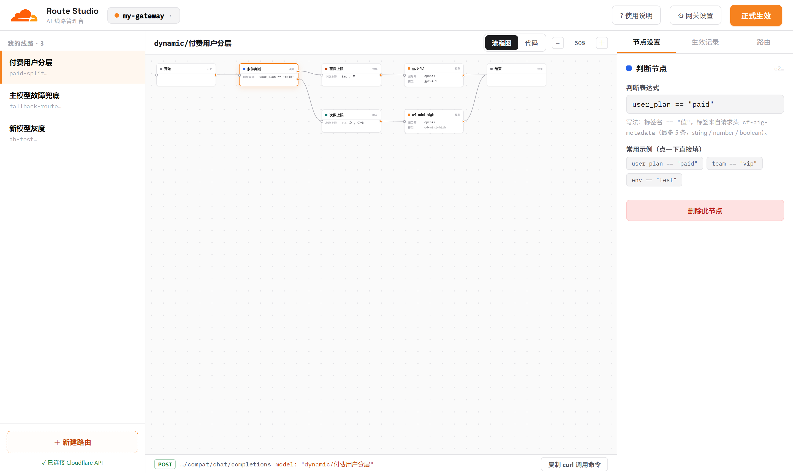
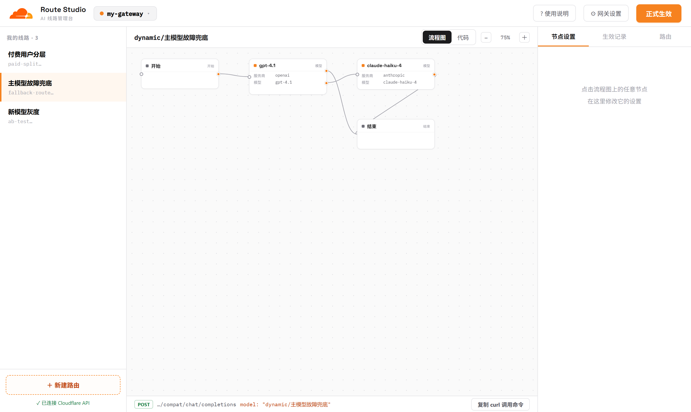
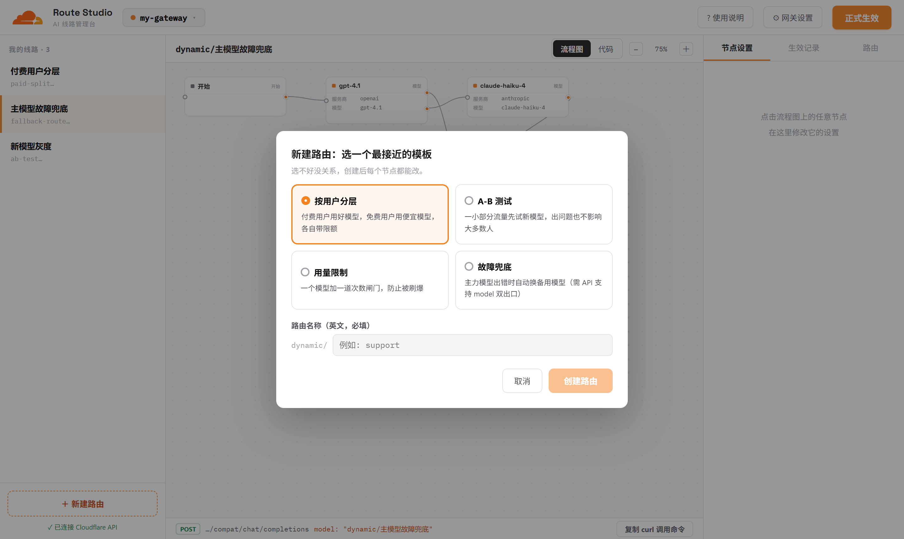
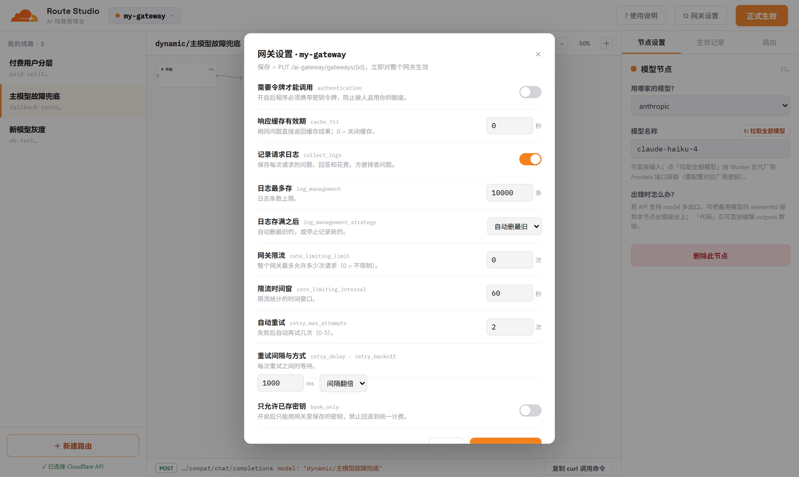
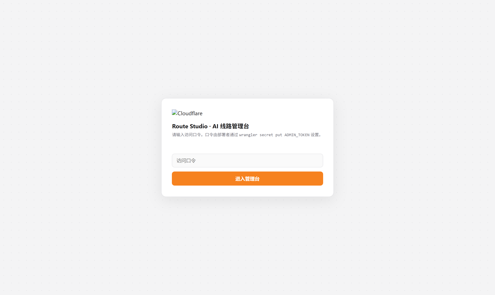

# Route Studio — AI Gateway 动态路由可视化管理台（Worker 版）

部署在 Cloudflare Workers 上的 AI Gateway 动态路由管理台：登录门 + API 反代 + 可视化流程图。
所有数据来自真实接口（`api.cloudflare.com`），API Token 存在 Worker Secret 里，浏览器拿不到。

## 界面预览

**流程画布** —— 节点即配置，右侧表单即改即见（付费分层：条件 → 限额 → 模型 → 结束）：



**故障兜底** —— 模型节点双出口（正常 → 结束 / 出错 → 备用模型自动接管）：



**新建路由** —— 4 个大白话模板起步，创建后每个节点都能改：



**网关设置** —— 覆盖全部 API 可配置项，每项标注对应字段名：



**登录门** —— 整站口令保护，Token 只存在 Worker Secret：



## 功能

- 多网关切换（来自 `GET /accounts/{id}/ai-gateway/gateways`）
- 动态路由列表 / 新建（4 个模板）/ 删除
- 流程图可视化（由 elements 自动布局）＋「代码」页直接编辑 elements JSON
- 节点表单：模型（厂商下拉 + 反代 `/models` 拉取模型列表）、条件表达式、限流、预算、分流
- 版本管理：正式生效 = `POST versions` + `POST deployments`；回滚 = 重新部署旧版本
- 网关设置：`PUT /ai-gateway/gateways/{id}`（认证、缓存、日志、限流、重试、byok_only）
- 一键复制真实可执行的 curl 调用命令

## 部署方式：GitHub 连接自动部署（推荐，无需本地装任何东西）

> 原理：Cloudflare Workers Builds 监听你的 GitHub 仓库，每次 push 自动构建并执行 `npx wrangler deploy`。

### 第 1 步：上传到 GitHub

1. 在 GitHub 新建一个**私有仓库**（如 `ai-gateway-route-studio`，私有即可，代码无任何密钥）。
2. 把本目录（`worker/`）的内容作为仓库根目录上传：

```bash
cd 本目录
git init
git add .
git commit -m "Route Studio: AI Gateway 动态路由可视化管理台"
git branch -M main
git remote add origin https://github.com/<你的用户名>/ai-gateway-route-studio.git
git push -u origin main
```

> ⚠️ 不要把 `.dev.vars` 提交上去（已在 `.gitignore` 里排除，正常 `git add .` 不会带上）。

### 第 2 步：Cloudflare 连接仓库

1. 登录 [dash.cloudflare.com](https://dash.cloudflare.com) → **Workers & Pages** → **Create application** → 在 **Import a repository** 处选 **Get started**。
2. 授权 GitHub 账号，选择刚才的仓库，分支选 `main`。
3. 构建设置（本项目无构建步骤，保持默认即可）：
   - **Build command**：留空
   - **Deploy command**：默认 `npx wrangler deploy`
   - **Root directory**：留空（仓库根目录就是本项目；若你把本项目放在仓库子文件夹，这里填该子文件夹路径）
4. 点 **Save and Deploy**，约 1 分钟后得到 `https://ai-gateway-route-studio.<你的子域>.workers.dev`。

### 第 3 步：配置变量与密钥（Dashboard 操作，不需要命令行）

进入 Worker → **Settings → Variables and Secrets → Add**：

| 类型 | 变量名 | 值 | 说明 |
|---|---|---|---|
| Text | `ACCOUNT_ID` | 你的账户 ID | dash 右侧栏可查；也可直接改 `wrangler.jsonc` 里的 vars 后 push |
| Secret | `ADMIN_TOKEN` | 自定强口令 | 管理台登录口令 |
| Secret | `CF_API_TOKEN` | Cloudflare API Token | 需要 **AI Gateway:Edit** + **Account Settings:Read** 权限 |
| Secret | `OPENAI_API_KEY` 等 | 各厂商密钥 | 可选，配了才能在线拉取模型列表 |

> ⚠️ **密钥务必选 Secret 类型，不要选 Text**：
> - **Text 变量**每次部署都会被仓库里的 `wrangler.jsonc` 覆盖——Dashboard 里设置但配置文件里没有的 Text 变量会被删掉。
> - **Secret 类型永不被部署清除**（官方保证）。
> - 本项目已在 `wrangler.jsonc` 里加了 `keep_vars: true`，Dashboard 的 Text 变量也会保留；但密钥仍建议用 Secret 类型（值不可见，更安全）。

配置完**重新部署一次**（Deployments → 上一次成功构建 → Retry，或 push 一个空提交）让 Secret 生效。

### 第 4 步：访问

打开 `https://ai-gateway-route-studio.<子域>.workers.dev`，输入 ADMIN_TOKEN 即可。
之后每次 `git push` 到 main 分支都会自动重新部署。

> 注意：Worker 名称必须与 `wrangler.jsonc` 里的 `name` 一致（默认 `ai-gateway-route-studio`），
> 否则构建会失败。改名字的话两边一起改。

## 部署方式二：wrangler CLI（备选）

```bash
npx wrangler login
# 编辑 wrangler.jsonc 里的 ACCOUNT_ID
npx wrangler secret put ADMIN_TOKEN      # 管理台访问口令
npx wrangler secret put CF_API_TOKEN     # API Token：AI Gateway:Edit + Account Settings:Read
npx wrangler secret put OPENAI_API_KEY   # 可选：拉取模型列表（其他厂商同理）
npx wrangler deploy
```

## 本地开发

```bash
cp .dev.vars.example .dev.vars   # 填入测试用 token（.dev.vars 不要提交 git）
npx wrangler dev                 # http://localhost:8787
```

## 故障排查

**访问报 Error 1101（Worker threw exception）**

1. 先访问 `https://<你的域名>/api/health`，返回各绑定状态：
   - `assets: false` → 部署时未应用 `wrangler.jsonc` 的 assets 配置。最常见原因：在 Dashboard「快速编辑」里只粘贴了 `src/worker.js` 创建的 Worker（没有静态资源绑定，一访问页面就 1101）。修复：删掉该 Worker，改用上面的 GitHub 连接部署（Workers Builds 会按仓库里的 wrangler.jsonc 完整部署），或在 `worker/` 目录本地执行 `npx wrangler deploy`。
   - `adminToken / cfApiToken: false` → 对应 Secret 没配置，去 Settings → Variables and Secrets 添加后重新部署。
   - `accountIdSet: false` → 账户 ID 未配置。
2. health 正常但个别操作报错 → Dashboard → 该 Worker → **Logs → Begin log stream**，然后刷新页面/重试操作，可看到具体异常堆栈。
3. 本项目 Worker 已内置全局异常兜底：任何内部异常都会返回带堆栈的 JSON 报错（HTTP 500），不会再出现空白 1101——升级到最新代码后报错信息可直接看响应内容。

## 已知边界（以实际 API 返回为准）

- 动态路由 elements 的字段结构以 `GET /routes/{id}` 实际返回为准；前端做了归一化，
  「代码」页可直接编辑 JSON 兜底。
- 模型节点多出口（出错→备用）依赖 API 是否支持 model 双输出；fallback 模板创建时
  如被 API 拒绝，可在「代码」页调整。
- 「拉取全部模型」两种方式（自动选择）：
  1. Worker 配置了对应厂商密钥（`OPENAI_API_KEY` 等 Secret）→ 直连厂商 API 拉取；
  2. 未配置 → **走你网关的 BYOK 透传**（`gateway.ai.cloudflare.com/v1/{acc}/{网关}/{厂商}/v1/models`），
     自动复用你在 AI Gateway → Provider Keys 里存的密钥，**无需再配置任何厂商密钥**。
     仅当网关开启了认证（Authentication）时才需要额外配 `CF_AIG_TOKEN`（AI Gateway 页面生成的令牌）。
  某厂商两种方式都不可用时，会提示手动输入模型名。
- 版本列表字段（id / created_at / active）若与预期不同，前端按归一化尽力渲染。
